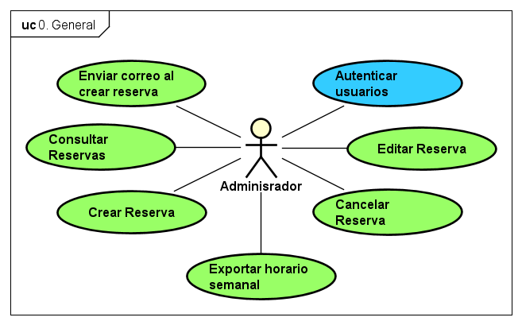
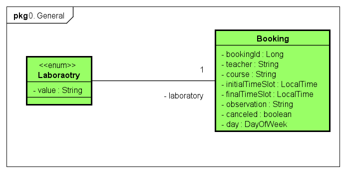
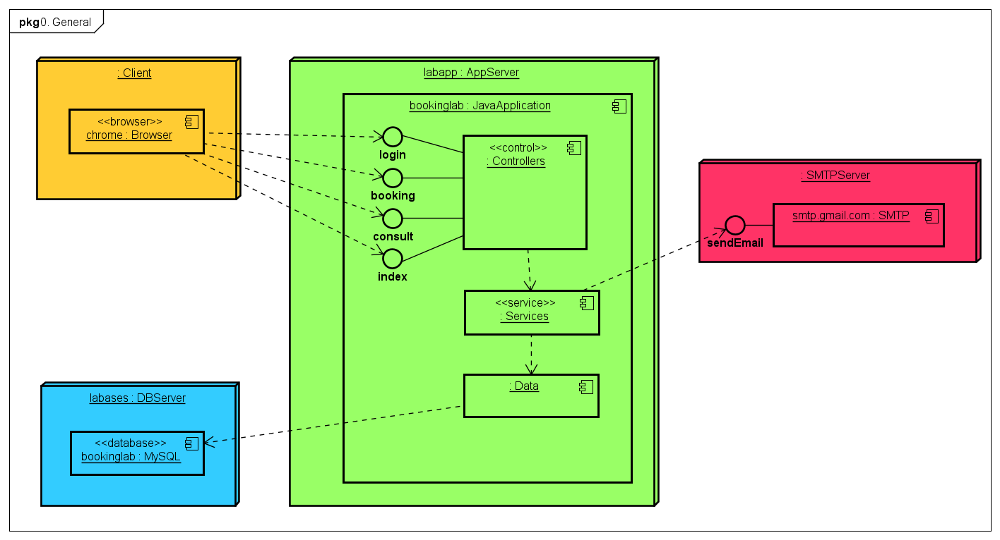

# BookingLab

El proyecto implementación de una herramienta para las reservas de salones del Laboratorio de Informática tiene como objetivo simplificar y optimizar la creación de reservas.

## Descripción de la aplicación 📖

La aplicación BookingLab es una herramienta que permite a los administradores del laboratorio de informática de la Universidad Escuela Colombiana de Ingeniería Julio Garavito realizar reservas de salones del Laboratorio de Informática. La aplicación permite iniciar una reserva, enviar correo electrónico de confirmación de la reserva, cancelar una reserva y poder consultar las reservas por profesor, por salón y por materia.

**Visualización de la página de inicio de sesión.**


**Visualización de página principal después de iniciar sesión.**


**Visualización de la página para crear una reserva.**


**Visualización de la página de consultas, la cual permite consultar las reservas por porfesor, por salón y por materia, además, permite exportar el horario semanal**


**Ejemplo del horario semanal que se exporta.**


## Comenzando 🚀

Las siguientes instrucciones le permitirán obtener una copia del proyecto en funcionamiento en su máquina local para fines de desarrollo y prueba.

### Requisitos 📋

* [Git](https://git-scm.com/) - Control de versiones
* [Maven](https://maven.apache.org/) - Manejador de dependencias
* [Java](https://www.oracle.com/java/technologies/downloads/#java17) - Lenguaje de programación
* [Docker](https://www.docker.com/) - Contenedor de aplicaciones

> [!IMPORTANT]
> Es necesario tener instalado Git, Maven, Docker y Java 17 para poder ejecutar el proyecto con efectos de desarrollo.

### Instalación 🔧

Realice los siguientes pasos para clonar el proyecto en su máquina local.

```bash
git clone https://github.com/Laboratorio-de-Informatica/BookingLab.git
cd BookingLab/
```

## Ejecutando la aplicación ⚙️

Para ejecutar la aplicación, ejecute el siguiente comando para crear un contenedor con MySQL debe asegurarse que docker esté instalado y en ejecución:

```bash
docker run -p 3306:3306 --name some-mysql -e MYSQL_ROOT_PASSWORD=my-secret-pw -d mysql:latest
```

> [!NOTE]  
> El anterior comando creará un contenedor con MySQL en el puerto 3306, el nombre del contenedor será `some-mysql` y la contraseña del usuario root será `my-secret-pw`.

> [!WARNING]  
> Si desea visualizar el envio de correos debe configurar las credenciales de su correo en el archivo `application.properties` que se encuentra en la ruta `src/main/resources/application.properties`, ingrese su correo en la propiedad `spring.mail.username` y su contraseña en la propiedad `spring.mail.password`, además del host de su correo `spring.mail.host`.

```bash
mvn clean compile spring-boot:run
```

El anterior comando compilará y ejecutará la aplicación, espere a que la aplicación se inicie y muestre un mensaje similar al siguiente:

Diríjase a su navegador de preferencia y vaya a la siguiente dirección: <http://localhost:8081/login.xhtml> para ver la aplicación en funcionamiento.

Si desea empaquetar en un jar asegurate de tener el `application.properties` configuardo con la base de datos a la que te vas a conectar luego de eso ejecuta el comando:

```bash
mvn clean package
```

Para ejectuar la aplicacion usa el siguiente comando:

```bash
java -jar target/bookinglab.jar
```

## Versionado 📌


## Dependencias 🛠️

Se está utilizando el framework de Spring Boot para el desarrollo de la aplicación. Las dependencias utilizadas son:

* 

    La versión de Java indicada es la versión utilizada para el desarrollo de la aplicación.

* 

    Maven es la herramienta utilizada para la construcción del proyecto. La versión de Maven indicada es la versión utilizada para el desarrollo de la aplicación.

* 

    Spring Boot es el framework utilizado para el desarrollo de la aplicación. La versión de Spring Boot indicada es la versión utilizada para el desarrollo de la aplicación.

* 

    Spring Security es la dependencia utilizada para la seguridad de la aplicación. La versión de Spring Security indicada es la versión utilizada para el desarrollo de la aplicación.

* 

    MySQL Conector es la dependencia utilizada para la conexión con la base de datos MySQL. La versión de MySQL Conector indicada es la versión utilizada para el desarrollo de la aplicación.

* 

    Join Faces es la dependencia utilizada para la integración de PrimeFaces con Spring Boot. La versión de Join Faces indicada es la versión utilizada para el desarrollo de la aplicación.

* 

    Prime Faces es la dependencia utilizada para la interfaz gráfica de la aplicación. La versión de Prime Faces indicada es la versión utilizada para el desarrollo de la aplicación.

* 

    Embedded Tomcat es la dependencia utilizada para el servidor web embebido de la aplicación. La versión de Embedded Tomcat indicada es la versión utilizada para el desarrollo de la aplicación.

* 

    Lombok es la dependencia utilizada para la generación de getters, setters, constructores y otros métodos. La versión de Lombok indicada es la versión utilizada para el desarrollo de la aplicación.

> [!TIP]
> Si se desea utilizar una versión diferente de las dependencias indicadas, se debe cambiar la versión en el archivo `pom.xml` que se encuentra en la raíz del proyecto. Luego de esto se debe compilar el proyecto de nuevo con Maven.

## Diagramas 📊

Los casos de uso de la aplicación son los siguientes:



El diagrama de conceptos es el siguiente:



El diagrama de despliegue de la aplicación es el siguiente:



## Autores ✒️

Equipo de monitores del laboratorio de informática de la Universidad Escuela Colombiana de Ingeniería Julio Garavito 2024-1.

* **Daniel Santanilla** - [ELS4NTA](https://github.com/ELS4NTA)
* **Andres Oñate** - [AndresOnate](https://github.com/AndresOnate)
* **David Valecia** - [DavidVal6](https://github.com/DavidVal6)
* **Angie Mojica** - [An6ie02](https://github.com/An6ie02)

## Licencia 📄

[](https://creativecommons.org/licenses/by-sa/4.0/)

Este proyecto está bajo la licencia de Creative Commons Reconocimiento-CompartirIgual 4.0 Internacional (CC BY-SA 4.0) para más detalles consulte el archivo [LICENSE](LICENSE)
